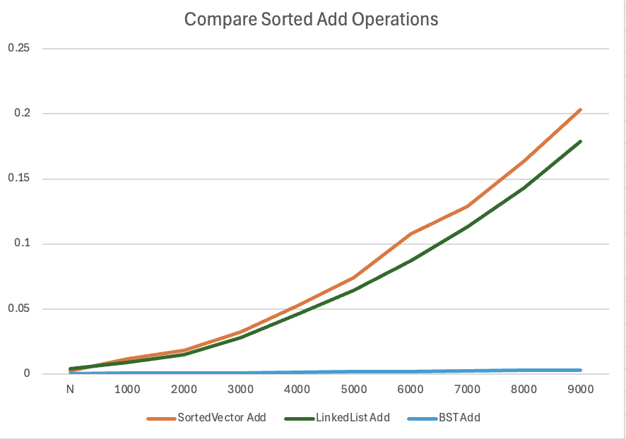
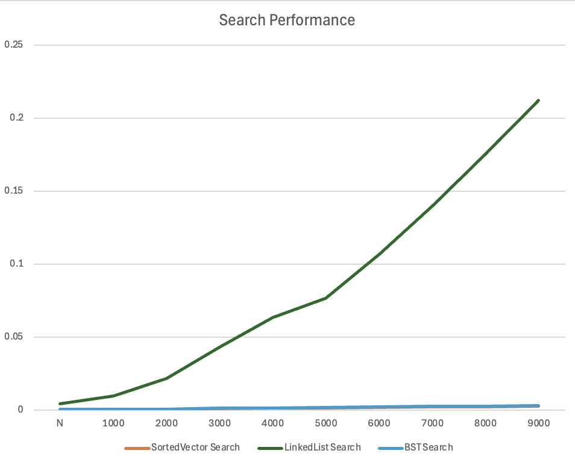
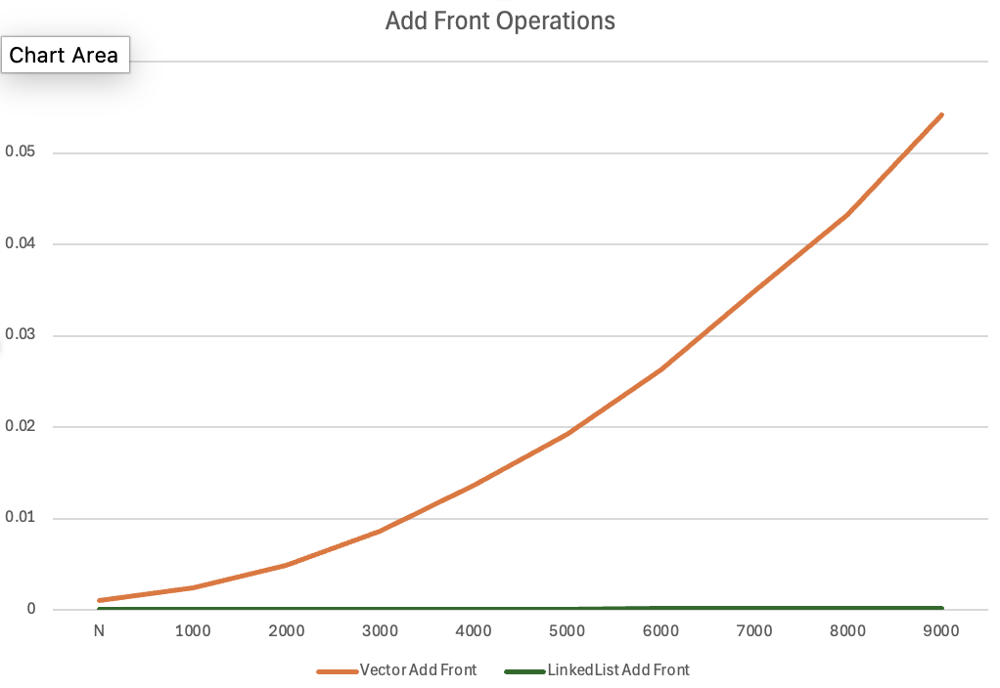

# Report for Data Structure Speed Comparison Homework

Make sure to answer every question in this homework. You should not bullet point your answers, but
instead write them as a full report format. This doesn't mean you have to be wordy, as concise is good,
but it does mean you need to use proper grammar, spelling, and be complete. For question that just
ask for a short answer, answer accordingly. Make sure to include references where appropriate.

## Algorithmic Analysis - Big $O$

Complete the Big O table below for the following functions. You may use any resource you like, but
for the SortedVector and SortedList, you should use the Big O for the functions you wrote in the
the homework. Both Single and Double Linked List you can assume head and tail pointers are available. 
Don't forget to use latex math notation (example in the table).

### Big $O$ Table

| -                         | Add/Insert | Remove     | Search/Find | Sort       | Add Front | Add Back | Remove Front | Remove Back | Get by Index |
| ------------------------- |:----------:|:----------:|:-----------:|:----------:|:---------:|:--------:|:------------:|:-----------:|:------------:|
| Vector                    | $O(n)$     | $O(n)$     | $O(n)$      | $O(n\log n)$ | $O(n)$    | $O(1)$   | $O(n)$       | $O(1)$      | $O(1)$       |
| Single Linked List        | $O(n)$     | $O(n)$     | $O(n)$      | $O(n\log n)$ | $O(1)$    | $O(1)$   | $O(1)$       | $O(n)$      | $O(n)$       |
| Double Linked List        | $O(n)$     | $O(n)$     | $O(n)$      | $O(n\log n)$ | $O(1)$    | $O(1)$   | $O(1)$       | $O(1)$      | $O(n)$       |
| Sorted Vector             | $O(n)$     | $O(n)$     | $O(\log n)$ | $O(1)$     | ---       | ---      | ---          | ---         | ---          |
| Sorted Single Linked List | $O(n)$     | $O(n)$     | $O(n)$      | $O(1)$     | ---       | ---      | ---          | ---         | ---          |
| Sorted Double Linked List | $O(n)$     | $O(n)$     | $O(n)$      | $O(1)$     | ---       | ---      | ---          | ---         | ---          |
| Binary Search Tree        | $O(n)$     | $O(n)$     | $O(n)$      | $O(n)$     | ---       | ---      | ---          | ---         | ---          |

For Sort, we are asking for the Big $O$ for taking the current data structure and writing it 'sorted' to a file. However, not the file writes. For example, if you have a vector of 1000 elements, and you want to write it to a file, you would need to sort it first. So, the Big $O$ for this would be the Big $O$ for sorting. For BST, you have to convert the tree to a sequential structure, so the cost of doing that.  

### Assumptions with Sort

Since the worst case can change considerably based on what sort you use for sorting (if any), list each algorithm below, and specify the algorithm used in your assumption.  For BST, write which  method of traversal you would use to sort it.  

* Vector - Would use a sorting algorithm like quicksort or mergesort: $O(n\log n)$
* Single Linked List - Would use merge sort (best for linked lists): $O(n\log n)$
* Double Linked List - Would use merge sort: $O(n\log n)$
* Sorted Vector - Already sorted, just iterate and write: $O(n)$
* Sorted Single Linked List - Already sorted, just iterate and write: $O(n)$
* Sorted Double Linked List - Already sorted, just iterate and write: $O(n)$
* Binary Search Tree - Use inorder traversal to get sorted order: $O(n)$

### Worst Case vs. Average Case

There are a few functions whose worse case is very different than the average case. Name at least two of them, and explain why the worse case is so much worse than the average case. 

1. Binary Search Tree operations: A Binary Search Tree works fast when it’s nicely balanced, usually around $O(\log n)$, which is good. But if you add items in sorted order, the tree becomes one sided and starts to look more like a linked list instead of a tree. When this happens, the operations slow down to $O(n)$ in the worst case.

2. Sorted Vector Remove: To remove an item from a sorted vector, I can find it quickly with binary search, which takes $O(\log n)$ time. But after finding it, I must shift all the elements after it to fill the gap. That shifting takes $O(n)$ time.
So overall, removing an item from a sorted vector ends up taking $O(n)$ time, especially bad if the element is near the front, because then almost the whole vector has to move.

## Empirical Analysis - Speed Comparison

For this section, you will need to have run the speed compare program and generated the output into a CSV file.

### Empirical Results Table

Add a link from this document to the CSV file you generated. The CSV file must have at least 15 different N values, but
often can have a lot more depending on what you ran.  

[results.csv](results.csv)

### Analysis

Create *at least three* graphics that each visually explain an aspect of your data related to an operation or data structure. Under each one, explain what the graphic is showing, and what you can conclude from it/what you find interesting about it.


> [!IMPORTANT]
> 
> Make sure you are comparing apples to apples and not apples to oranges when choosing what to put in the same graph. 
> 
> **:x: different data structures *and* different operations**
> 
> - Vector Add Front versus BST Add
> 
> **:white_check_mark: different operations *but* same data structure**
> 
> - BST Add versus Remove, and Search for BST
> 
> **:white_check_mark: different data structures *but* same operation**
> 
> - BST Add versus Add for Sorted Vector, and Sorted Single/Double Linked List
> 
> - Vector Add Front versus Add Front for Single/Double Linked List

> [!TIP]
> 
> To create the graphics you can use a third party program like Microsoft Excel or Google Sheets. (Completely optional if you want extra coding: you can use python libraries such as matplotlib, seaborn, or plotly)
> 
> Make sure you can see the image embedded in the Report.md using [image markdown] when you upload it to github, and get help if it doesn't show! 

#### Graph 1: Sorted Structure Add Performance



This graph shows how fast different sorted data structures can add new items. The Binary Search Tree is the fastest because it only follows one branch to find where the new value goes. The time does not increase much as the tree grows. The LinkedList is slower because it has to go through the list one step at a time to find the right place. The SortedVector is the slowest. It can find the position quickly, but it must move all the items after it to make space, which takes more time as the list gets bigger.

#### Graph 2: Search Performance Comparison



The search performance shows why indexed or tree-based structures are better. Both SortedVector and BST stay very fast. SortedVector uses binary search on continuous memory, and BST moves down the tree. LinkedList search gets slower as the list grows. Even though it is sorted, it cannot use binary search and must check each node one by one. This takes $O(n)$ time when the item is not found or is near the end.

#### Graph 3: Add Front Operations - Vector vs LinkedList



This graph shows the difference between arrays and linked lists for adding at the front. Vector Add Front gets slower as the size grows because each new item needs all existing elements to move one step to the right. This takes $O(n)$ time. LinkedList Add Front stays very fast because it only needs to create a new node and update two pointers. This takes the same time no matter how big the list is, showing $O(1)$ performance. This is why linked lists are better for stack-like operations with frequent front access.


## Critical Thought

### Data Evaluation

Answer the questions below. Make sure to answer each question fully, and explain your reasoning. Indent your answers immediately below the question, for it to line up with the bullet point.

For example:

```markdown
1. What is the most surprising result from the data? Why is it surprising?
   Answer here
```

1. What is the most surprising result from the data? Why is it surprising?
   
   The most surprising thing is how much slower searching in a LinkedList is compared to a SortedVector, even though both keep their data in order. Searching in a SortedVector stays very fast because it can use binary search, while searching in a LinkedList gets slower as the list grows since it has to go through each item one by one. This shows that just having sorted data isn’t enough for quick searches, the structure itself needs to let me access items efficiently.

2. What data structure is the fast at adding elements (sorted)? Why do you think that is?
   
   The Binary Search Tree is the fastest when adding elements in sorted order because it only has to follow one path down the tree, comparing values at each level. It does make comparisons like other structures, but it doesn’t have the extra work of moving elements like a SortedVector or going through the whole list like a LinkedList. The tree automatically keeps everything in order through its left and right branches, so no extra rearranging is needed.

3. What data structure is the fastest at removing elements (sorted)? Why do you think that is?
   
   The Binary Search Tree is the fastest at removing elements because it only needs to adjust the connections around the node being removed. A SortedVector has to move all the elements that come after the removed item, and a LinkedList has to go through the list to find the element before it can remove it. The BST is fast because it combines quick searching with only small changes to its structure.

4. What data structure is the fastest at searching? Why do you think that is?
   
   The SortedVector is the fastest for searching because it can use binary search on a continuous block of memory, which allows it to jump directly to the right position and take advantage of the way memory is stored in the computer. The Binary Search Tree has a similar theoretical speed, but it has to follow pointers from one node to the next, which can slow things down because of how memory is accessed. Using binary search together with an array makes the SortedVector very efficient for finding items.

5. What data structure is the fastest for adding elements to the front? Why do you think that is?
   
   A LinkedList is the fastest when adding elements to the front because it always takes the same amount of time, no matter how big the list is. It just creates a new node and updates the head pointer. A Vector, on the other hand, has to move all the existing elements to make space at the beginning, which makes it much slower as it gets larger.

6. What data structure is the fastest for adding elements to the back? Why do you think that is?
   
   Adding elements to the back is equally fast for both a Vector and a LinkedList because it takes the same amount of time regardless of size. A Vector can add directly to the end of its allocated space as long as there is room, and a LinkedList can use its tail pointer to insert at the end. Neither one needs to move existing elements or go through the structure to find the spot.
7. What data structure is the fastest for removing elements from the front? Why do you think that is?
   
   Removing an element from the front is fastest with a LinkedList because it only has to move the head pointer to the next node and free the old head, which always takes the same amount of time. A Vector, however, has to shift all the remaining elements forward to fill the empty spot, which takes more time as the vector gets bigger and grows proportionally to its size.

8. What data structure is the fastest for removing elements from the back? Why do you think that is?
   
   Removing an element from the back is fastest with a Vector because it can just reduce its size counter and free memory if needed, which always takes the same amount of time. A singly linked list has to go through the whole list to find the second-to-last node so it can update the pointer, which takes longer as the list grows. A doubly linked list can do this quickly because it can directly access the node before the tail.

### Deeper Thinking

#### Double Linked List vs Single Linked List

1. If you wrote your linked list as a single linked list, removing from the back was expensive. If you wrote it as a double linked list, removing from the back was cheap. Why do you think that is?
   
  In a singly linked list, removing the last element means I have to go through the whole list to find the second-to-last node. I then set its next pointer to NULL and update the tail. This takes $O(n)$ time because I check all n-1 nodes. In a doubly linked list, each node has a pointer to the previous node. I can go directly from the tail to the second-to-last node. This lets me remove the last element in $O(1)$ time.

2. When running most functions, at least ~30% of the tests were worse case scenarios. Why do you think that is? 

   The test creates worst case situations. Some items that are searched or removed do not exist in the data. About 30% of the test items are outside the range of added items. This makes the search and remove operations go through the whole structure before deciding the item is not there.

3. What was done in the code to encourage that? 

   The build_sample_indexes function uses a SAMPLE_SPLIT constant set to 0.7. This makes 70% of test operations use items that are in the data structures. The other 30% use items that might not exist. This split creates a mix of successful and unsuccessful operations. It tests both normal and worst case performance.

4. How did this particularly influence the linked list searches?

   For linked lists, searching for items that do not exist means going through the whole list until reaching NULL without a match. This always takes $O(n)$ time. In a BST or SortedVector, unsuccessful searches can stop early using tree pruning or binary search. Linked lists have to check every node to be sure the item is not there. This makes the average time for linked list operations much higher than for structures that can stop early.

#### Test Bias

1. The tests were inherently biased towards the BST to perform better due the setup of the experiment. Explain why this is the case.  (hint: think about the randomization of the data, and the worst case scenario for BST).

   The test data uses movie titles from the input file that are randomly shuffled. This creates fairly balanced BSTs. In a balanced BST, the height is about $\log n$, so operations take $O(\log n)$ time. If the data were sorted or had patterns, the BST could become like a linked list and take $O(n)$ time in the worst case. Randomizing the data helps the BST stay fast in the tests.

2. What would generate the worst case scenery for a BST?

   The worst case for a BST happens when data is added in sorted order, either ascending or descending. Each new node is added as only a left child or only a right child. This makes the tree completely unbalanced, like a linked list. In this case, all operations add, search, and remove take $O(n)$ time instead of $O(\log n)$. I have to go through the entire height of the tree, which is equal to the number of nodes.

3. Researching beyond the module, how would one fix a BST so the worst case scenario matches (or at least i closer to) the average case.[^1^]

   Self-balancing binary search trees, like AVL trees and Red-Black trees, keep the tree from becoming unbalanced. They adjust the tree after adding or removing nodes. This keeps the height around $\log n$. AVL trees keep the two sides of each node almost the same height. Red-Black trees use colors to keep a loose balance. Both types make sure add, search, and remove operations stay fast, in $O(\log n)$ time. The tree needs extra steps when adding or removing to stay balanced.

## Scenario

Fill out the table below. This is a common technical interview topic!

| Structure          | Good to use when                                                                 | Bad to use when                                                                  |
| ------------------ | -------------------------------------------------------------------------------- | -------------------------------------------------------------------------------- |
| Vector             | You need fast random access by index and mostly add or remove from the back      | You frequently add or remove from the front or middle of the collection |
| Linked List        | Good for stacks with frequent front only access                                  | When you need random access by index or search operations |
| Sorted Vector      | When values coming in are already mostly sorted and we need quick search access. | When space is limited and the dataset is extremely large causing memory to swap. |
| Sorted Linked List | When data naturally arrives in sorted order and you rarely search                | When you need efficient searching or the data is not arriving in order |
| BST                | When you need efficient search, insert, and delete operations with random data   | data is presorted                                                                |


## Conclusion

Summarize your findings. Where there any surprises?  What did you end up learning by comparing speeds?


The speed tests showed important things about how data structures work in real life. The biggest surprise was that Big O complexity does not always match real performance. Memory layout and pointer overhead matter a lot. BST and SortedVector both have logarithmic search times in theory, but SortedVector was faster because it uses continuous memory, which works better with the computer’s cache. Another finding was the big difference in speed for operations at different ends. LinkedList is very fast at the front, and Vector is very fast at the back. The test also showed how data order affects BST performance. Random insertion makes balanced trees that work well. Sorted insertion makes unbalanced trees that work poorly. Overall, I learned that choosing the right data structure requires thinking about more than just algorithm complexity. I also need to consider how data will be used, its patterns, and how implementation details affect speed.

## Technical Interview Practice Questions

For both these questions, are you are free to use what you did as the last section on the team activities/answered as a group, or you can use a different question.

1. Select one technical interview question (this module or previous) from the [technical interview list](https://github.com/CS5008-khoury/Resources/blob/main/TechInterviewQuestions.md) below and answer it in a few sentences. You can use any resource you like to answer the question.
   
   Explain what a hash table is. What is the process of hashing?

   A hash table is a data structure that stores and finds data very quickly. It uses a key to find the value instead of looking through all the data. This makes adding, searching, and deleting very fast, usually in constant time. Hashing is the process of turning a key into a position in the table. A hash function changes the key into a number called a hash code. This number is then used to pick an index in the table. The value is stored at that index. Sometimes two keys give the same index. This is called a collision. Collisions can be handled by linking items together at the same index or by finding another empty spot.

1. Select one coding question (this module or previous) from the [coding practice repository](https://github.com/CS5008-khoury/Resources/blob/main/LeetCodePractice.md) and include a c file with that code with your submission. Make sure to add comments on what you learned, and if you compared your solution with others. 

   link to the question: https://leetcode.com/problems/remove-element/submissions/1821940974/?envType=list&envId=ofbiscdi
   I saved the code in the file and named it 'leecode.c'


## References

Add your references here. A good reference includes an inline citation, such as [1] , and then down in your references section, you include the full details of the reference. Computer Science research often uses [IEEE] or [ACM Reference format].

1. GeeksforGeeks. 2025. Difference between Singly Linked List and Doubly Linked List. Retrieved July 11 2025 from https://www.geeksforgeeks.org/dsa/difference-between-singly-linked-list-and-doubly-linked-list/

2. BYJU’S. 2025. Difference between Singly Linked List & Doubly Linked List. Retrieved from https://byjus.com/gate/difference-between-singly-linked-list-doubly-linked-list/
3. GeeksforGeeks. 2025. Singly Linked List Tutorial. Retrieved October 5 2025 from https://www.geeksforgeeks.org/dsa/singly-linked-list-tutorial/

4. Zeil, R. 2013. How Fast Are Binary Search Trees? Retrieved from https://www.cs.odu.edu/~zeil/cs333/f13/Public/trees/trees-htmlsu2.html


[1] Reference info, date, etc.

[^1^]: Implementing a BST with a self-balancing algorithm, such as AVL or Red-Black Trees is a great research paper topic!

<!-- links moved to bottom for easier reading in plain text (btw, this a comment that doesn't show in the webpage generated-->

[image markdown]: https://docs.github.com/en/get-started/writing-on-github/getting-started-with-writing-and-formatting-on-github/basic-writing-and-formatting-syntax#images

[ACM Reference Format]: https://www.acm.org/publications/authors/reference-formatting
[IEEE]: https://www.ieee.org/content/dam/ieee-org/ieee/web/org/conferences/style_references_manual.pdf
